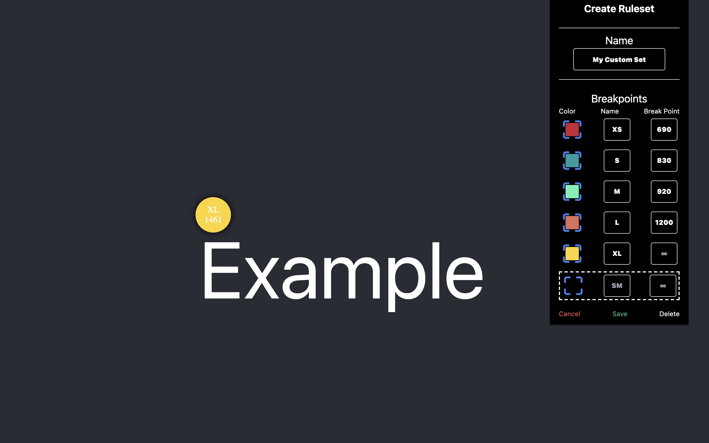

# CSS Breakpoint Button
### Find it on [Chrome](https://chrome.google.com/webstore/detail/css-breakpoint-button/hanagefkggieaghgifnhmjnkeilgemda)
### Find it on [Firefox](https://addons.mozilla.org/en-US/firefox/addon/css-breakpoint-button/)

## Building For Production (extension verification)
1. `npm install`
2. `npm run build`
3. Production assets are found in the `dist` folder. 
   During the build stage a zipped version is created under `assets` 
   as `{parent-folder}-v.x.x.x-production.zip`

## Building for Development
1. `npm install`
2. `npm serve`

## 3rd Party libraries used
- `core-js: ^3.6.5` - [core-js](https://github.com/zloirock/core-js/tree/v3.6.5)
- `feather-icons: ^4.28.0` - [Feather Icons](https://github.com/feathericons/feather/tree/v4.28.0)
- `ts-debounce: ^3.0.0` - [ts-debounce](https://github.com/chodorowicz/ts-debounce/tree/v3.0.0)
- `vue: ^2.6.14` - [Vue](https://github.com/vuejs/vue/releases/tag/v2.6.14)
- `vue-color-picker-wheel: ^0.4.3` - [vue-color-picker-wheel](https://github.com/stijlbreuk/vue-color-picker-wheel)
- `vuex: ^3.4.0` - [vuex](https://github.com/vuejs/vuex/tree/v3.4.0)
- `webextension-polyfill: ^0.8.0` - [webextension-polyfill](https://github.com/mozilla/webextension-polyfill/tree/0.8.0)

